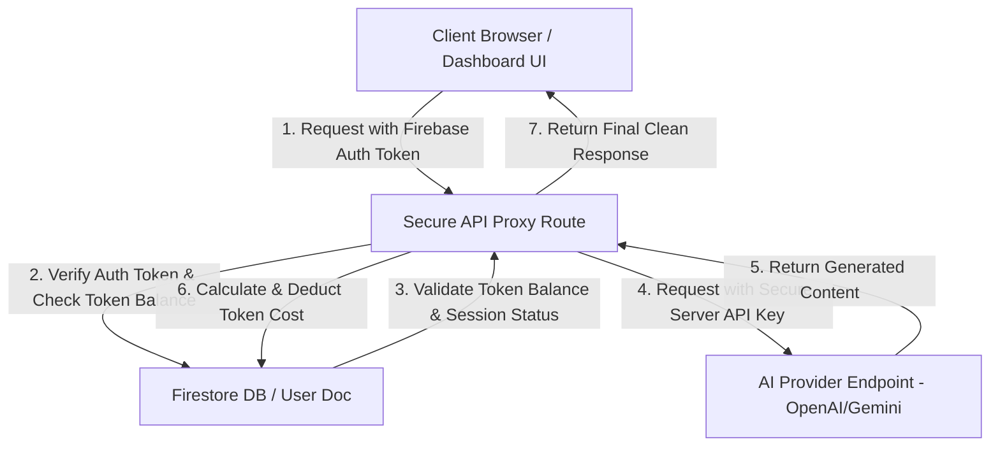

# Secure AI API Integration and Architecture Guide

This guide explains how to securely integrate OpenAI, Anthropic, and Google Gemini APIs into your user-facing dashboard interfaces. It outlines the catastrophic risks associated with client-side API key usage and provides a complete architectural blueprint and code execution setup for a secure backend proxy.

---

## 1. The Threat: Client-Side API Key Exposure

> [!CAUTION]
> Making API requests directly to OpenAI, Anthropic, or Gemini from your browser application (frontend JavaScript files) requires you to embed your raw API key in the source code. Doing so allows anyone to inspect your app's network requests or browser bundle, extract your secret keys, and use them to compile massive bills under your name.

### Why Client-Side AI API Calls are Dangerous:
- **Zero Key Safety:** Any key starting with `sk-...` (OpenAI), `sk-ant-...` (Anthropic), or a Google Cloud API Key is easily retrievable via the browser's developer console in the **Network** or **Sources** tab.
- **No Rate Limit Control:** Attackers can extract your key and run parallel high-volume scripts that will consume your API balance within minutes, resulting in immediate account suspension or massive charges.
- **Inability to Cache Responses:** Browser-side requests cannot share a unified caching layer, meaning you pay for duplicate, identical requests across different user sessions.

---

## 2. Secure Architecture Blueprint

To protect your API keys, implement a **Secure Backend Proxy Pattern** using Firebase Cloud Functions or Node.js server routes. The client-side application only communicates with your secure backend, which in turn signs and manages the communication with the third-party AI provider.

### Architecture Data Flow:



---

## 3. Server-Side Secure API Proxy Implementation

Create a secure backend endpoint using Node.js and the official OpenAI SDK. This endpoint validates the user's active session, checks their Firestore database token balance, processes the query, deducts the token cost, and returns the response safely.

Create a secure server API handler (e.g., `api/ai/generate.js`):

```javascript
const { OpenAI } = require("openai");
const admin = require("firebase-admin");

// Initialize Firebase Admin if not active
if (!admin.apps.length) {
  admin.initializeApp({
    credential: admin.credential.applicationDefault()
  });
}
const db = admin.firestore();

// Initialize the secure server-side OpenAI client
// The process.env.OPENAI_API_KEY environment variable is isolated from the browser
const openai = new OpenAI({
  apiKey: process.env.OPENAI_API_KEY
});

/**
 * Secure Server API Proxy for AI Prompt Generation.
 */
async function generateAIHandler(req, res) {
  // Extract user authorization headers
  const authHeader = req.headers.authorization;
  if (!authHeader || !authHeader.startsWith("Bearer ")) {
    return res.status(401).json({ error: "Unauthorized access: Missing session token." });
  }

  const idToken = authHeader.split("Bearer ")[1];
  const { promptInput } = req.body;

  if (!promptInput) {
    return res.status(400).json({ error: "Missing required parameter: promptInput." });
  }

  try {
    // 1. Verify the client's Firebase Auth Token
    const decodedToken = await admin.auth().verifyIdToken(idToken);
    const userId = decodedToken.uid;

    // 2. Fetch user's current token balance from Firestore
    const userDocRef = db.collection("users").doc(userId);
    const userDoc = await userDocRef.get();

    if (!userDoc.exists) {
      return res.status(404).json({ error: "User profile record not found." });
    }

    const currentBalance = userDoc.data().tokenBalance || 0;
    if (currentBalance <= 0) {
      return res.status(403).json({ error: "Insufficient token balance. Please upgrade your plan." });
    }

    // 3. Dispatch secure request to OpenAI API
    const chatCompletion = await openai.chat.completions.create({
      model: "gpt-4-turbo",
      messages: [{ role: "user", content: promptInput }],
      max_tokens: 500
    });

    const aiResponseText = chatCompletion.choices[0].message.content;
    const inputTokens = chatCompletion.usage.prompt_tokens;
    const outputTokens = chatCompletion.usage.completion_tokens;
    const totalTokensConsumed = inputTokens + outputTokens;

    // 4. Update user's token balance in Firestore
    const newBalance = Math.max(0, currentBalance - totalTokensConsumed);
    await userDocRef.update({
      tokenBalance: newBalance
    });

    // 5. Log the query transaction
    await db.collection("queries").add({
      userId: userId,
      promptInput: promptInput,
      aiResponse: aiResponseText,
      tokensConsumed: totalTokensConsumed,
      timestamp: admin.firestore.FieldValue.serverTimestamp(),
      status: "success"
    });

    // 6. Return response safely to the browser
    return res.status(200).json({
      success: true,
      result: aiResponseText,
      balanceRemaining: newBalance
    });

  } catch (error) {
    console.error("Secure AI Proxy Error:", error.message);
    return res.status(500).json({ error: "Failed to process security or AI generation request." });
  }
}

module.exports = { generateAIHandler };
```

---

## 4. Client-Side Dashboard Component Fetch Request

To communicate with this secure proxy, implement a standard HTTP request from your dashboard UI component. Pass the current user's authentication token within the headers.

```javascript
import { auth } from "../config/firebase";
import { useState } from "react";

export function AIPromptInterface() {
  const [prompt, setPrompt] = useState("");
  const [response, setResponse] = useState("");
  const [loading, setLoading] = useState(false);

  const handleSubmit = async (e) => {
    e.preventDefault();
    setLoading(true);

    try {
      const user = auth.currentUser;
      if (!user) {
        throw new Error("User session is inactive.");
      }

      // Retrieve the current user's JWT ID Token from Firebase
      const idToken = await user.getIdToken(true);

      const res = await fetch("/api/ai/generate", {
        method: "POST",
        headers: {
          "Content-Type": "application/json",
          "Authorization": `Bearer ${idToken}` // Secure authentication passing
        },
        body: JSON.stringify({ promptInput: prompt })
      });

      const data = await res.json();
      if (!res.ok) {
        throw new Error(data.error || "Generation request failed.");
      }

      setResponse(data.result);
    } catch (err) {
      console.error("Dashboard error:", err.message);
      setResponse(`Error: ${err.message}`);
    } finally {
      setLoading(false);
    }
  };

  return (
    <div className="space-y-4">
      <form onSubmit={handleSubmit} className="space-y-2">
        <textarea
          value={prompt}
          onChange={(e) => setPrompt(e.target.value)}
          placeholder="Enter your prompt here..."
          className="w-full rounded-md bg-gray-900 border border-gray-800 text-white p-3 focus:border-blue-500 focus:outline-none"
          rows={4}
        />
        <button
          type="submit"
          disabled={loading}
          className="bg-blue-600 hover:bg-blue-700 text-white px-4 py-2 rounded-md transition-colors"
        >
          {loading ? "Generating..." : "Generate AI Output"}
        </button>
      </form>
      {response && (
        <div className="bg-gray-950 p-4 border border-gray-800 rounded-md">
          <p className="text-gray-300 whitespace-pre-wrap">{response}</p>
        </div>
      )}
    </div>
  );
}
```
